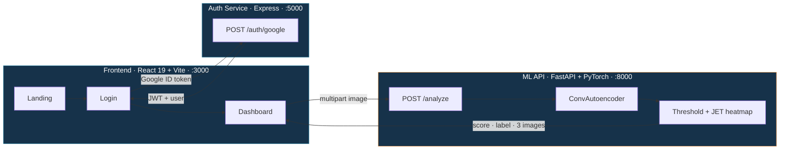

<div align="center">


<br/>

[](https://www.python.org/)
[](https://pytorch.org/)
[](https://fastapi.tiangolo.com/)
[](https://react.dev/)
[](https://www.typescriptlang.org/)
[](https://vitejs.dev/)
[](https://tailwindcss.com/)
[](https://streamlit.io/)


</div>

---

## Overview

Earth-observation constellations image the planet on a repeat cycle, producing tiles far faster than any analyst can review them. Environmental crimes — illegal logging, unauthorised construction, marine oil discharge — are plainly visible in that data, but only if someone finds them in time.

This project trains a **convolutional autoencoder exclusively on normal satellite scenes**. The network compresses a 128×128 RGB tile into a 512-dimensional latent vector and rebuilds it. Normal input reconstructs cleanly; anomalous input does not. The per-pixel reconstruction error becomes both the **anomaly score** and a **localisation heatmap** showing exactly where the deviation lies.

Because training never sees an anomaly, **no anomaly labels are required** — which matters, since real anomalies are rare, visually diverse and expensive to annotate.

<div align="center">

| | |
|:--|:--|
| **Paradigm** | Unsupervised / one-class reconstruction |
| **Input** | 128 × 128 × 3 RGB tile |
| **Latent** | 512-d dense bottleneck |
| **Loss** | Mean squared error, Adam @ `1e-3` |
| **Decision** | `score > μ + k·σ` on held-out normals (`k = 3`) |
| **Output** | Score · label · original · reconstruction · JET heatmap |

</div>

---

## Demo

> [!NOTE]
> Replace the placeholders below with real captures once the model is trained. Delete this section entirely rather than shipping broken images.

<div align="center">


<br/><br/>

<table>
<tr>
<td align="center"><br/><b>Original</b></td>
<td align="center"><br/><b>Reconstruction</b></td>
<td align="center"><br/><b>Error heatmap</b></td>
</tr>
</table>


</div>

---

## Architecture



<div align="center">

| Layer | Stack | Responsibility | Port |
|:--|:--|:--|:--:|
| **Frontend** | React 19 · TypeScript 5.8 · Vite 6 · Tailwind 4 · React Router 7 · Motion · Recharts · Lucide · Cobe | Landing page, Google SSO login, protected dashboard, heatmap viewer, metrics, scan history, terminal logs | `3000` |
| **Auth service** | Node.js · Express 5 · google-auth-library · jsonwebtoken | Verifies the Google ID token, mints a 1-hour JWT | `5000` |
| **ML API** | Python · FastAPI · Uvicorn · PyTorch · OpenCV · Pillow | Loads the checkpoint, runs inference, encodes results as base64 JPEG | `8000` |
| **Streamlit app** | Streamlit · PyTorch · OpenCV | Standalone testing UI with a live threshold slider | `8501` |

</div>

---

## The model

`satellite_anomaly_detection/src/model.py` — a symmetric convolutional autoencoder with a dense bottleneck.

<div align="center">

| Stage | Operation | Output shape |
|:--|:--|:--|
| Input | — | `[B, 3, 128, 128]` |
| Enc 1 | `Conv2d(3→32, k3, p1)` · ReLU · BatchNorm · MaxPool(2) | `[B, 32, 64, 64]` |
| Enc 2 | `Conv2d(32→64, k3, p1)` · ReLU · BatchNorm · MaxPool(2) | `[B, 64, 32, 32]` |
| Enc 3 | `Conv2d(64→128, k3, p1)` · ReLU · BatchNorm · MaxPool(2) | `[B, 128, 16, 16]` |
| Bottleneck | `Flatten` → `Linear(32768→512)` · ReLU | `[B, 512]` |
| Expand | `Linear(512→32768)` · ReLU → reshape | `[B, 128, 16, 16]` |
| Dec 1 | `ConvTranspose2d(128→64, k2, s2)` · ReLU · BatchNorm | `[B, 64, 32, 32]` |
| Dec 2 | `ConvTranspose2d(64→32, k2, s2)` · ReLU · BatchNorm | `[B, 32, 64, 64]` |
| Dec 3 | `ConvTranspose2d(32→3, k2, s2)` · Sigmoid | `[B, 3, 128, 128]` |

</div>

`forward()` returns `(reconstructed, latent)` — the latent vector is exposed for future work on latent-space clustering.

### Training objective

$$
\mathcal{L} = \frac{1}{N}\sum_{i=1}^{N} \big\lVert x_i - D_\theta\big(E_\phi(x_i)\big) \big\rVert_2^2
$$

Optimiser **Adam** at `lr = 1e-3`, with `ReduceLROnPlateau(patience=3, factor=0.5)` on validation loss. The checkpoint with the lowest validation loss is written to `models/best_autoencoder.pth`.

### Thresholding

The decision boundary is calibrated on **held-out normal images only** — never on anomalies:

$$
\tau = \mu_{\text{val}} + k \cdot \sigma_{\text{val}}, \qquad k = 3
$$

A tile is flagged when its mean reconstruction error exceeds $\tau$. The API and Streamlit app both ship a fallback default of `0.015` and allow the threshold to be overridden at request time.

### Localisation

The per-pixel error map is clipped at its **99th percentile** — so one blown-out pixel can't wash out the image — normalised to `[0, 255]` and colour-mapped with `cv2.COLORMAP_JET`. Red regions are where the decoder failed hardest.

---

## Data

`dataset.py` expects a `torchvision.ImageFolder` layout with exactly two classes:

```
data/satellite_images_sample/
├── Normal/          # training + validation (80/20 split)
│   ├── forest_01.jpg
│   └── ...
└── Anomaly/         # evaluation only — never enters the training loop
    ├── deforestation_01.jpg
    └── ...
```

**Suggested sources** — [EuroSAT](https://github.com/phelber/EuroSAT) (treat `Forest` as Normal and `Industrial` as Anomaly), or DeepGlobe Land Cover.

**Augmentation** (training split only): resize to 128×128, random horizontal flip, random vertical flip, random rotation ±15°. Validation and test use resize + `ToTensor()` with no augmentation.

> [!IMPORTANT]
> Only the `Normal` class is used to fit the model. `Anomaly` exists purely so `evaluate.py` can measure how well the model separates the two. Leaking anomalies into training defeats the entire premise.

---

## Project structure

```
Satellite-Anomaly-Detection-using-Convolutional-Autoencoders/
│
├── src/                                  # React frontend
│   ├── App.tsx                           # Routes: / · /login · /dashboard (guarded)
│   ├── main.tsx
│   ├── index.css
│   ├── utils/cn.ts                       # clsx + tailwind-merge helper
│   ├── components/
│   │   ├── landing/                      # Navbar · Hero · FeaturesBento
│   │   │                                 # HowItWorks · DemoShowcase · PricingCards · Footer
│   │   └── dashboard/
│   │       ├── Sidebar.tsx
│   │       ├── ImageDropzone.tsx         # Drag-and-drop upload
│   │       ├── HeatmapViewer.tsx         # Anomaly overlay + loss graph
│   │       ├── MetricsPanel.tsx          # Score, label, precision/recall
│   │       ├── ModelRegistry.tsx
│   │       ├── ScanHistory.tsx
│   │       ├── SystemSettings.tsx
│   │       └── TerminalLogs.tsx
│   └── pages/                            # Landing · Login · Dashboard
│
├── backend/
│   ├── server.js                         # Express — POST /auth/google
│   └── package.json
│
├── satellite_anomaly_detection/
│   ├── src/
│   │   ├── model.py                      # ConvAutoencoder
│   │   ├── dataset.py                    # ImageFolder loaders, Normal-only filter
│   │   ├── train.py                      # MSE + Adam + ReduceLROnPlateau
│   │   ├── detect.py                     # AnomalyDetector: threshold, predict, visualize
│   │   ├── evaluate.py                   # ROC-AUC, P/R/F1, confusion matrix
│   │   └── utils.py                      # Four-panel overlay visualisation
│   ├── api.py                            # FastAPI — POST /analyze · GET /health
│   ├── app.py                            # Streamlit UI with threshold slider
│   ├── data/                             # Normal/ and Anomaly/ tiles
│   ├── models/                           # best_autoencoder.pth
│   └── requirements.txt
│
├── results/                              # loss_graph.png · roc_curve.png · confusion_matrix.png
├── docs/assets/                          # Screenshots for this README
├── index.html · vite.config.ts · tsconfig.json · package.json
└── .env.example
```

---

## Getting started

### Prerequisites

`Node.js ≥ 18` · `Python ≥ 3.10` · `pip` · (optional) a Google OAuth client ID

### 1 · Clone

```bash
git clone https://github.com/smrutiparhi/Satellite-Anomaly-Detection-using-Convolutional-Autoencoders.git
cd Satellite-Anomaly-Detection-using-Convolutional-Autoencoders
```

### 2 · Environment

```bash
cp .env.example .env
```

```ini
# Leave auth disabled for local development — the login page falls back to a mock user
VITE_ENABLE_GOOGLE_AUTH="false"
VITE_GOOGLE_CLIENT_ID=""

# Required only when VITE_ENABLE_GOOGLE_AUTH is true
GOOGLE_CLIENT_ID=""
JWT_SECRET="change-me"
```

### 3 · Run the services

<table>
<tr><th align="left" width="140">Service</th><th align="left">Commands</th></tr>
<tr><td><b>Frontend</b><br/><code>:3000</code></td><td>

```bash
npm install
npm run dev
```

</td></tr>
<tr><td><b>Auth</b><br/><code>:5000</code></td><td>

```bash
cd backend
npm install
npm start
```

</td></tr>
<tr><td><b>ML API</b><br/><code>:8000</code></td><td>

```bash
cd satellite_anomaly_detection
pip install -r requirements.txt
python api.py
```

</td></tr>
</table>

Then open **http://localhost:3000**.

The dashboard is behind a route guard that reads `user` from `localStorage`, so you must pass through `/login` first.

---

## Training and evaluation

All Python commands below run from inside `satellite_anomaly_detection/`.

```bash
# Train on Normal/ only — 30 epochs, batch 32, lr 1e-3 by default
python src/train.py
```

Writes the best checkpoint to `models/best_autoencoder.pth` and a learning curve to `results/loss_graph.png`.

```bash
# Calibrate the threshold on validation normals, then score the full test set
python src/evaluate.py
```

Prints precision, recall and F1, and saves `results/roc_curve.png` and `results/confusion_matrix.png`.

```bash
# Standalone testing UI with a live threshold slider
streamlit run app.py
```

> [!TIP]
> `evaluate.py` currently ends in `pass` — uncomment the `evaluate_model(...)` call in its `__main__` block before running it.

---

## API reference

### `POST /analyze`

Multipart upload. Optional `threshold` query parameter overrides the server default of `0.015`.

```bash
curl -X POST "http://localhost:8000/analyze?threshold=0.015" \
  -F "file=@tile.png"
```

```jsonc
{
  "score": 0.04173,
  "label": "Anomaly",
  "isAnomaly": true,
  "images": {
    "original":      "data:image/jpeg;base64,/9j/4AAQSkZJRg...",
    "reconstructed": "data:image/jpeg;base64,/9j/4AAQSkZJRg...",
    "heatmap":       "data:image/jpeg;base64,/9j/4AAQSkZJRg..."
  }
}
```

Returns `500` if the checkpoint was not found at startup.

### `GET /health`

```jsonc
{ "status": "ok", "model_loaded": true }
```

### `POST /auth/google` — port 5000

```jsonc
// request
{ "credential": "<Google ID token>" }

// response
{
  "token": "<JWT, 1h expiry>",
  "user": { "name": "…", "email": "…", "picture": "…" }
}
```

Returns `401` on an invalid token.

---

## Results

> [!WARNING]
> Placeholder — populate from `evaluate.py` before publishing. A README with an empty results table reads as abandoned.

<div align="center">

| Method | Type | ROC-AUC | Precision | Recall | F1 |
|:--|:--|:--:|:--:|:--:|:--:|
| PCA reconstruction | Linear baseline | — | — | — | — |
| One-Class SVM | Kernel baseline | — | — | — | — |
| **ConvAutoencoder (ours)** | **Deep, unsupervised** | **—** | **—** | **—** | **—** |

</div>

**Dataset** — source `TBD` · tile size `128×128` · normal tiles `TBD` · anomaly tiles `TBD` · train/val split `80/20` of normals

---

## Known issues

Tracked openly rather than hidden — each is a small, well-defined fix.

| Issue | Detail |
|:--|:--|
| **Path inconsistency** | `train.py` saves to `../models/` and `../results/` (relative to CWD), while `api.py` and `app.py` read from `models/` and `results/`. Running training from `satellite_anomaly_detection/` writes the checkpoint one directory too high. |
| **Inconsistent imports** | `api.py` uses `from src.detect import …` (run from the package root); `train.py` and `evaluate.py` use bare `from dataset import …` (relies on the script's own directory). Pick one convention. |
| **`evaluate.py` is a no-op** | Its `__main__` block is commented out and falls through to `pass`. |
| **Hardcoded JWT secret** | `backend/server.js` sets `JWT_SECRET = "super-secret-key"` inline. Move it to an environment variable. |
| **Express version mismatch** | Root `package.json` pins Express 4.22.1; `backend/package.json` pins Express 5.2.1. Only the backend one is actually used. |
| **Unused Gemini config** | `.env.example` requests `GEMINI_API_KEY` and `@google/genai` is a dependency, but nothing in the detection pipeline uses it. |
| **`utils.py` signature drift** | `visualize_anomaly()` calls `model(image_tensor)` expecting one return value, but `ConvAutoencoder.forward()` returns a tuple. |
| **Package metadata** | Root `package.json` is still named `react-example` with a stray HTML string in `description`. |

---

## Why this over existing work

<table>
<tr><th align="left">Gap in the literature</th><th align="left">What this project does</th></tr>
<tr>
<td>Most detectors require hyperspectral cubes; ordinary RGB tiles from public archives are under-served.</td>
<td>Operates directly on 3-channel imagery from open Earth-observation datasets.</td>
</tr>
<tr>
<td>Classical statistical detectors (the Reed–Xiaoli family) assume a Gaussian background and report high false-alarm rates.</td>
<td>A learned nonlinear background model replaces the Gaussian assumption.</td>
</tr>
<tr>
<td>Published deep models are evaluated offline — no path from image to actionable result.</td>
<td>End-to-end platform: authenticate, upload, infer, visualise, log.</td>
</tr>
<tr>
<td>Outputs are bare scores without explanation.</td>
<td>A JET heatmap shows <i>where</i> the anomaly is, not just that one exists.</td>
</tr>
</table>

---

## Roadmap

- [ ] Document dataset provenance, tile counts and split
- [ ] Train end to end and publish ROC-AUC, PR curve and confusion matrix
- [ ] Benchmark against PCA and One-Class SVM on the same split
- [ ] Fix the path and import inconsistencies listed above
- [ ] Move `JWT_SECRET` and the OAuth client ID to environment variables
- [ ] Add MS-SSIM alongside MSE for better structural fidelity
- [ ] Spatial attention in the bottleneck
- [ ] Multi-scale feature extraction for small-target anomalies
- [ ] Batch / folder analysis mode
- [ ] Dockerise all three services
- [ ] Deploy a public demo

---

## Team

<div align="center">

| Name | Roll number |
|:--|:--|
| **N Hemanth** *(Team Lead)* | 2410030028 |
| **Alok Kumar Singh** | 2410030048 |
| **Smruti Ranjan Parhi** | 2410030110 |
| **Arjun** | 2410030114 |

Department of Computer Science & Engineering<br/>
KL University — Hyderabad Campus

</div>

---

## References

1. I. S. Reed and X. Yu, "Adaptive multiple-band CFAR detection of an optical pattern with unknown spectral distribution," *IEEE Trans. Acoustics, Speech, and Signal Processing*, vol. 38, no. 10, pp. 1760–1770, 1990.
2. C.-I. Chang and S.-S. Chiang, "Anomaly detection and classification for hyperspectral imagery," *IEEE Trans. Geoscience and Remote Sensing*, vol. 40, no. 6, pp. 1314–1325, 2002.
3. S. Arisoy, N. M. Nasrabadi and K. Kayabol, "GAN-based hyperspectral anomaly detection," in *Proc. 28th European Signal Processing Conf. (EUSIPCO)*, pp. 1891–1895, 2020.
4. S. Wang, X. Wang, L. Zhang and Y. Zhong, "Auto-AD: Autonomous hyperspectral anomaly detection network based on fully convolutional autoencoder," *IEEE Trans. Geoscience and Remote Sensing*, vol. 60, pp. 1–14, 2022.
5. H. Zhao, M. Liu, S. Qiu and X. Cao, "Satellite unsupervised anomaly detection based on deconvolution-reconstructed temporal convolutional autoencoder," *IEEE Trans. Consumer Electronics*, vol. 70, no. 1, pp. 2989–2998, 2023.
6. Z. Wu et al., "Background-guided deformable convolutional autoencoder for hyperspectral anomaly detection," *IEEE Trans. Geoscience and Remote Sensing*, vol. 61, pp. 1–16, 2023.
7. "Convolutional autoencoders for data compression and anomaly detection in small satellite technologies," *Information*, vol. 16, no. 8, art. 690, 2025.
8. P. Helber, B. Bischke, A. Dengel and D. Borth, "EuroSAT: A novel dataset and deep learning benchmark for land use and land cover classification," *IEEE J. Selected Topics in Applied Earth Observations and Remote Sensing*, vol. 12, no. 7, pp. 2217–2226, 2019.

---

## License

Released under the MIT License. See [`LICENSE`](LICENSE).

---

<div align="center">


<sub>Built as a Project Based Learning submission · KL University, Hyderabad</sub>

</div>
